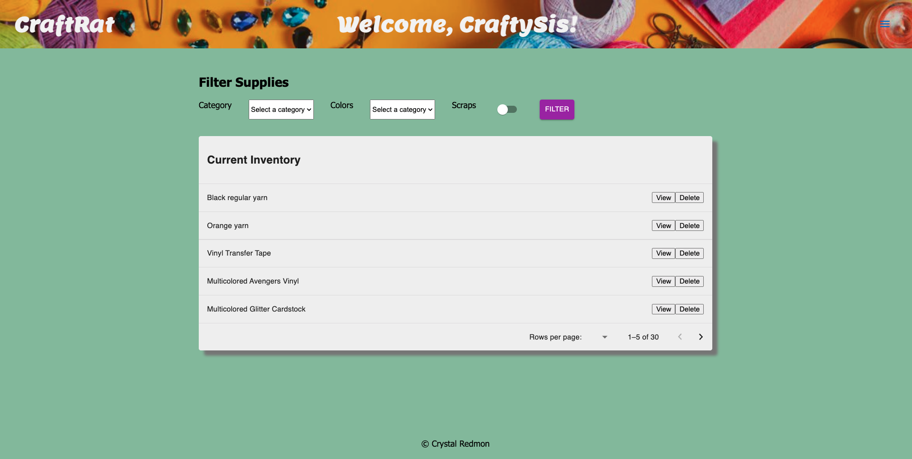
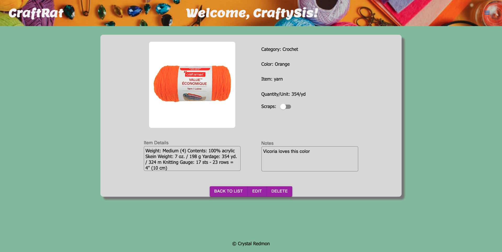
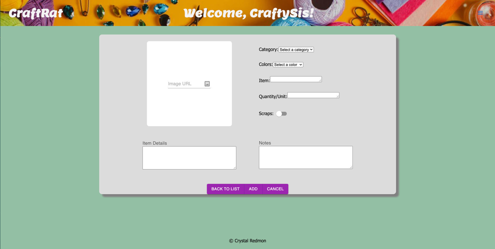

# craft-rat

_Durationn: 2 weeks_ 

## Description
CraftRat is the inventory tool for multi-crafters. It allows users to track inventory from different craft categories such as crochet, sewing, and paper. CraftRat allows users to keep track of what's on hand so they can continue to create by hand.  

## Screen Shot

## Installation

1. Create a database named `craft_rat`,
2. The queries in the `database.sql` file are set up to create all the necessary tables and populate the needed data to allow the application to run correctly. The project is built on [Postgres](https://www.postgresql.org/download/), so you will need to make sure to have that installed. We recommend using Postico to run those queries as that was used to create the queries, 
3. Open up your editor of choice and run an `npm install`
4. Run `npm run server` in your terminal
5. Run `npm run client` in your terminal
6. The `npm run client` command will open up a new browser tab for you!

#Usage

1. Once the user is registered they are brought to their homepage where a list of their current inventory can be viewed. 
2. Users can use the filter option to find supplies by category, color, or scraps.  
3. Item details can be viewed by clicking the View button. 
4. When supplies have been used, users can click Edit to update quantity, notes, or indicate that there are only scraps left. 
5. The Menu directs users to an Add Item feature where an image url, item details, colors, notes, and more. 
6. Supplies can be completely deleted from the homepage list view as well as the item details view. 

#Built With

- ReactJS
- Redux
- Saga
- Express
- NPM
- Node
- Axios
- Material UI
- JavaScript
- CSS
- HTML
- Postgres/Postico

## Acknowledgement
Thanks to [Prime Digital Academy](www.primeacademy.io) who equipped and helped me to make this application a reality. 

